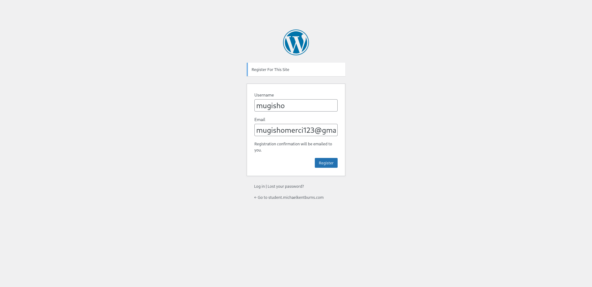
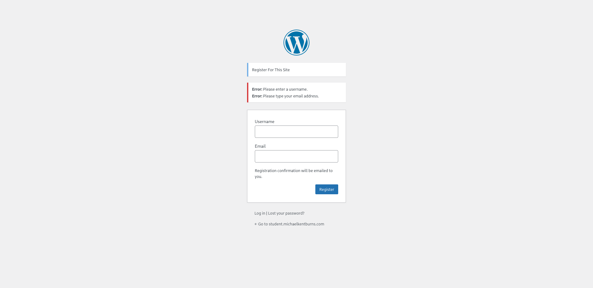
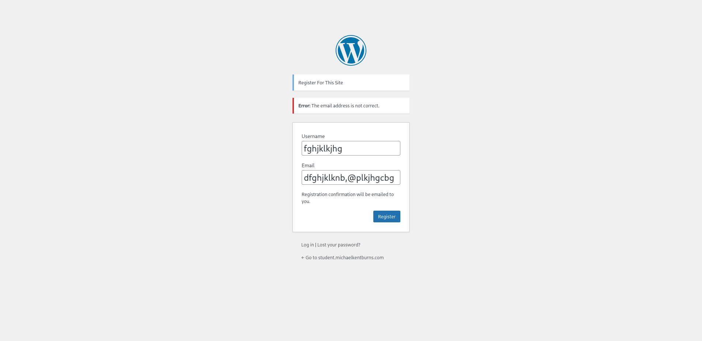
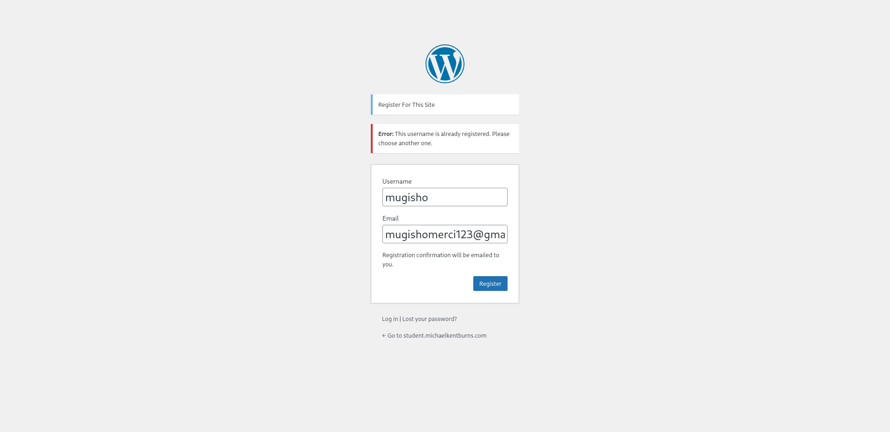
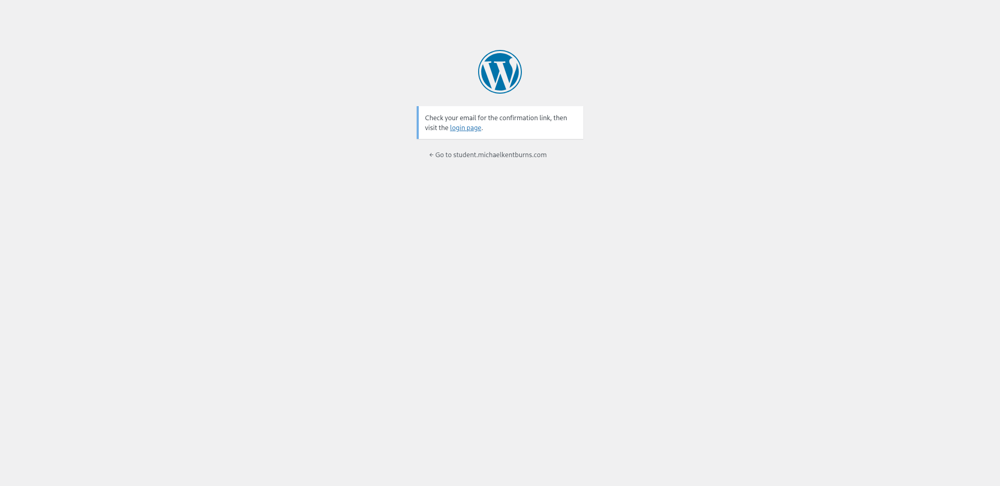
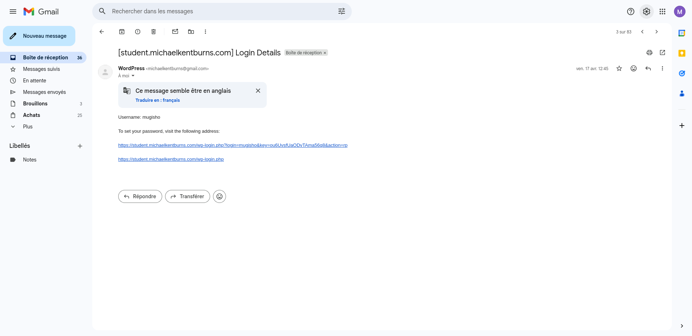
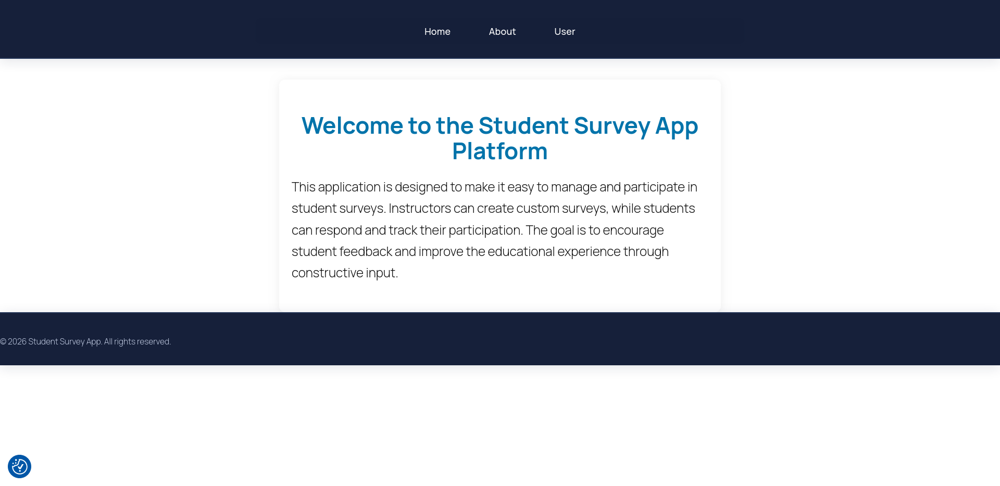
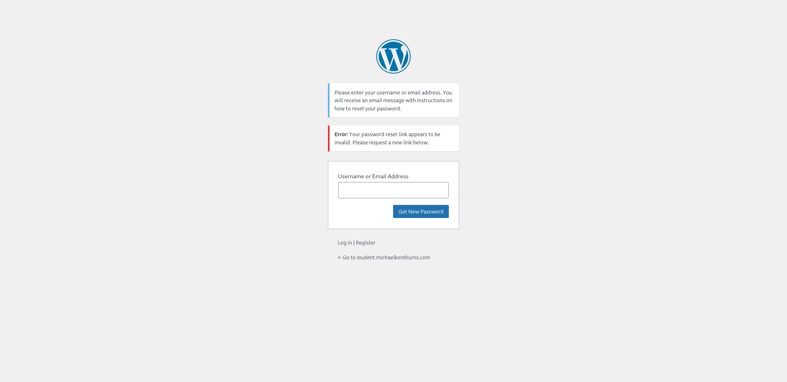
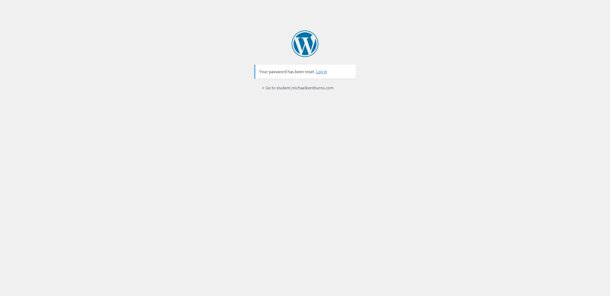
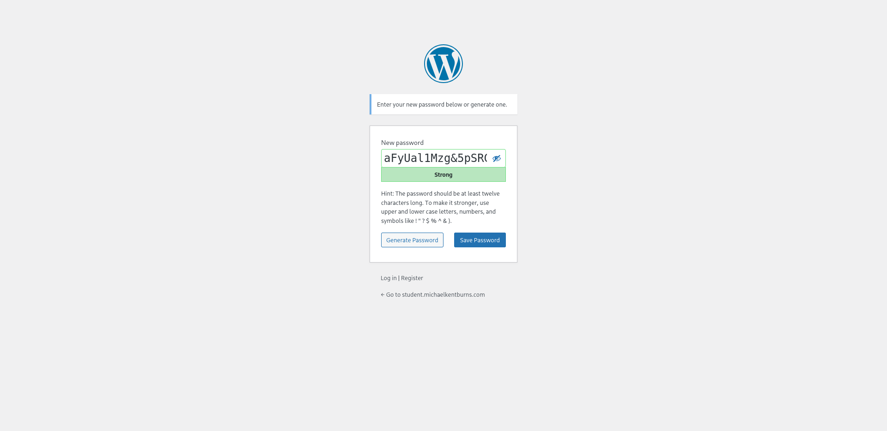

# Test Report — Use Case: Create Account (UC-Create_Account)

| Field             | Details                                                                   |
| ----------------- | ------------------------------------------------------------------------- |
| **Tester**        | Mugisho Merci                                                             |
| **Date**          | 2026-05-13                                                                |
| **Application**   | MKB Survey Web Application                                                |
| **Use Case**      | UC-Create_Account (sub-use case of UC-Login)                              |
| **Reference doc** | `doc/usecase-diagram/usecases/UC-Login/sub_UC-Login/UC-Create_Account.md` |
| **Test folder**   | `MUGISHO-MERCI-testing-documentation/test_create_account/`                |

---

## 1. What I Was Testing

I was testing the **account creation (registration) workflow** for the MKB Survey Application. This covers:

- Accessing the registration form
- Filling in personal and login information
- Handling validation errors (invalid email, duplicate email, duplicate user)
- Email confirmation flow
- Password reset / "Lost Password" flow after registration

---

## 2. Preconditions (from Use Case)

- The application is accessible via browser.
- No account exists yet for the test email.
- The system is connected to the authentication database and email server.

---

## 3. Test Cases Executed

### TC-01 · Accessing the Registration Form

**Steps:**

1. Opened the MKB Survey Application in the browser.
2. Navigated to the "Create Account" / Registration page.

**Expected result:** A registration form is displayed with fields for email, password, role selection, and (if Student) academic level and programming language.

**Observed result:** ✅ The registration form loaded correctly.

**Screenshot:**

---

### TC-02 · Missing Student-Specific Fields on Registration

**Steps:**

1. Opened the registration form.
2. Observed the fields available for account creation.

**Expected result (from UC-Create_Account):** If the user selects the "Student" role, the system must display fields for **academic level** and **preferred programming languages**.

**Observed result:** ⚠️ **The student-specific fields (academic level, programming languages) were absent from the form.** The form does not dynamically show role-specific fields.

**Type:** Missing behaviour  
**Severity:** High — The use case explicitly requires this data from students; its absence is both a functional gap and a data loss risk.

**Screenshot:**

---

### TC-03 · Submitting with an Invalid Email Address

**Steps:**

1. Opened the registration form.
2. Entered a malformed email address (e.g., missing `@` or domain).
3. Attempted to submit the form.

**Expected result (from UC-Create_Account, Alternative Course 4a):** The system must display an error highlighting the invalid field and prevent form submission.

**Observed result:** ✅ The system displayed an inline validation error for the email field.

**Screenshot:**

---

### TC-04 · Submitting with an Already-Registered Email

**Steps:**

1. Opened the registration form.
2. Entered an email address that already has an account in the system.
3. Attempted to submit the form.

**Expected result (from UC-Create_Account, Alternative Course 5a):** The system must display: _"An account with this email already exists."_ and redirect or prompt to log in or reset password.

**Observed result:** ✅ An error message was shown indicating the email is already in use.

**Screenshot:**

---

### TC-05 · Submitting with an Already-Existing Username / User

**Steps:**

1. Opened the registration form.
2. Entered credentials matching an existing user (username or email conflict).
3. Attempted to submit the form.

**Expected result:** The system must block submission and notify the user of the conflict.

**Observed result:** ✅ The system displayed an error indicating the user already exists.

**Screenshot:**

---

### TC-06 · Successful Submission → Email Confirmation Sent

**Steps:**

1. Filled out the registration form with valid, unique credentials.
2. Submitted the form.

**Expected result (from UC-Create_Account, Step 6):** The system stores the information and sends a confirmation email. The user is notified that their account is **pending approval**.

**Observed result:** ✅ A "Check your email" confirmation screen was displayed, prompting the user to verify their address.

**Screenshot:**

---

### TC-07 · Clicking the Confirmation Link in Gmail

**Steps:**

1. Opened the Gmail inbox for the test account.
2. Located the confirmation email sent by the application.
3. Clicked the confirmation link.

**Expected result:** The system should activate the account or confirm the email address and direct the user to the next step (pending admin approval or login).

**Observed result:** ✅ The link in the Gmail inbox was functional and led to the next step of the registration process.

**Screenshot:**

---

### TC-08 · Home Page After Registration

**Steps:**

1. Completed the registration and email confirmation process.
2. Was redirected to / landed on the application home page.

**Expected result:** The user arrives at a coherent landing/home page appropriate to their registration state.

**Observed result:** ✅ The home page was displayed correctly after the registration flow.

**Screenshot:**

---

### TC-09 · "Lost Password" Page (from Registration Context)

**Steps:**

1. From the login or registration area, clicked the "Lost Password" / "Forgot Password?" link.

**Expected result (from UC-Password_Recovery):** A password recovery form is displayed requesting the user's registered email.

**Observed result:** ✅ The Lost Password page loaded and displayed the email input form.

**Screenshot:**

---

### TC-10 · Setting a New Password (After Reset Link)

**Steps:**

1. Clicked the secure password reset link received by email.
2. Was directed to a password reset form.
3. Entered and confirmed a new password.

**Expected result (from UC-Password_Recovery, Steps 6–9):** A secure reset form is shown, allows password entry, and on submission confirms the update and redirects to the login page.

**Observed result:** ✅ The reset form was accessible and functional. A new password could be set.

**Screenshot:**

---

### TC-11 · Password Reset Confirmation Page

**Steps:**

1. After submitting the new password in TC-10, observed the system response.

**Expected result:** A success confirmation message is shown and the user is redirected to the login page.

**Observed result:** ✅ A reset password confirmation screen was displayed.

**Screenshot:**

---

## 4. Summary Table

| TC ID | Test Case Description                              | Status  | Severity |
| ----- | -------------------------------------------------- | ------- | -------- |
| TC-01 | Accessing the registration form                    | ✅ Pass | —        |
| TC-02 | Missing student-specific fields (level, languages) | ⚠️ Fail | **High** |
| TC-03 | Submitting with invalid email format               | ✅ Pass | —        |
| TC-04 | Submitting with already-registered email           | ✅ Pass | —        |
| TC-05 | Submitting with existing username/user             | ✅ Pass | —        |
| TC-06 | Successful submission → confirmation email sent    | ✅ Pass | —        |
| TC-07 | Clicking Gmail confirmation link                   | ✅ Pass | —        |
| TC-08 | Home page displayed after registration             | ✅ Pass | —        |
| TC-09 | "Lost Password" page accessible                    | ✅ Pass | —        |
| TC-10 | Setting a new password via reset link              | ✅ Pass | —        |
| TC-11 | Reset password confirmation page                   | ✅ Pass | —        |

---

## 5. Bug Report

### BUG-01 · Student-Specific Fields Missing from Registration Form

| Field             | Details                                                                              |
| ----------------- | ------------------------------------------------------------------------------------ |
| **ID**            | BUG-CREATE-01                                                                        |
| **Title**         | Student fields (academic level, programming languages) absent from registration form |
| **Type**          | Missing Behaviour                                                                    |
| **Severity**      | High                                                                                 |
| **Use Case Ref.** | UC-Create_Account — Steps 3a, Typical Course of Events                               |
| **Expected**      | Form shows level and programming language fields when "Student" is selected          |
| **Observed**      | No role-specific fields appear; all users see the same generic form                  |
| **Impact**        | Student profile data is incomplete; admin cannot properly assign students to cohorts |
| **Screenshot**    | `screenshots/registration_form_no_student_fields.png`                                |

---

## 6. Special Notes

> ⚠️ The registration form does not implement **role-based conditional fields**. This is a deviation from the documented use case (UC-Create_Account, Step 3a) which explicitly requires students to choose their academic level and programming languages during registration. This information is needed downstream for cohort assignment by the admin.

> ✅ All validation mechanisms (invalid email, duplicate email, duplicate user) are functioning correctly.

> ✅ The complete password recovery sub-flow (Lost Password → Email → Reset Link → New Password → Confirmation) works end-to-end as documented in UC-Password_Recovery.

---

## 7. Action Items

- [x] Documented test observations with screenshots
- [ ] Create a sub-issue for BUG-CREATE-01 (missing student fields)
- [ ] Add the **`bug`** label to the sub-issue
- [ ] Continue testing other use cases

---

## 8. Related Documents

- [UC-Create_Account](../../doc/usecase-diagram/usecases/UC-Login/sub_UC-Login/UC-Create_Account.md)
- [UC-Password_Recovery](../../doc/usecase-diagram/usecases/UC-Login/sub_UC-Login/UC-Password_Recovery.md)
- [UC-Login](../../doc/usecase-diagram/usecases/UC-Login/UC-Login.md)
- [Test Report: Login](../test_login/TEST_REPORT_login.md)
- [Test Report: Student Survey](../test_student_survey/TEST_REPORT_student_survey.md)
